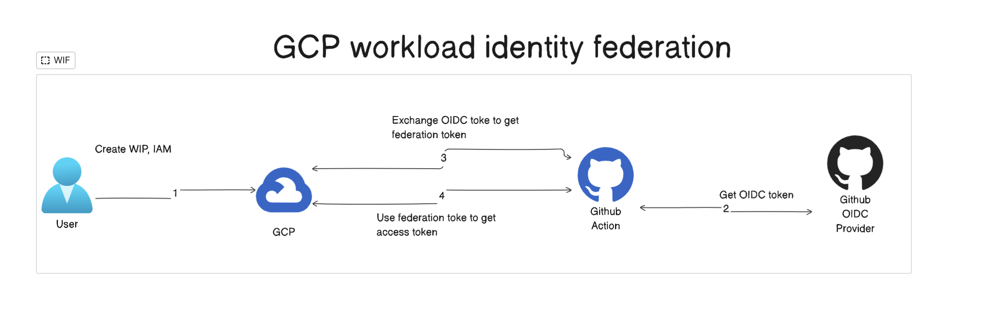

# lilurl-iac
Infrastructure codebase for lilurl service.

## Cloud Authnetication
It uses [GCP workload identity federation](https://cloud.google.com/iam/docs/workload-identity-federation) to grab a short lived token to make a connection to GCP project.

